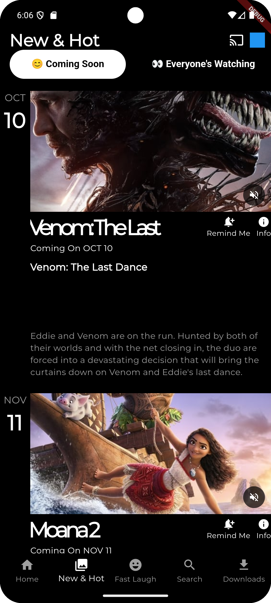
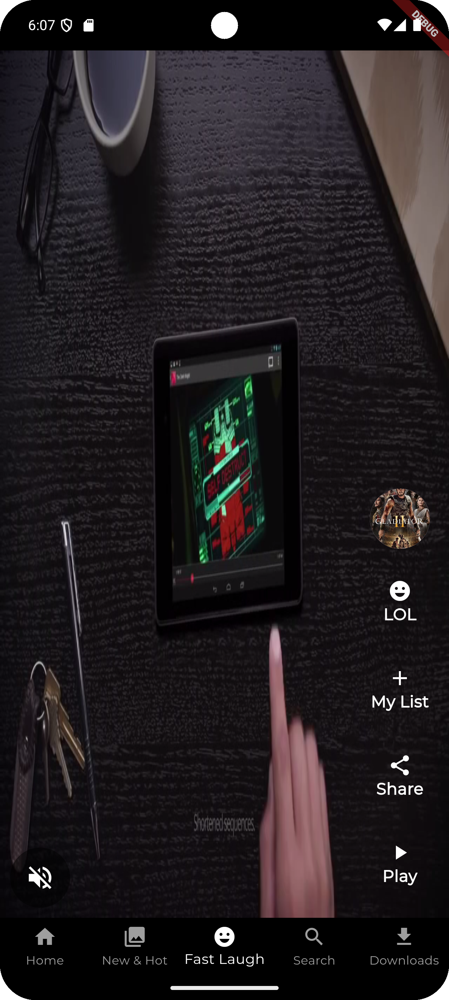
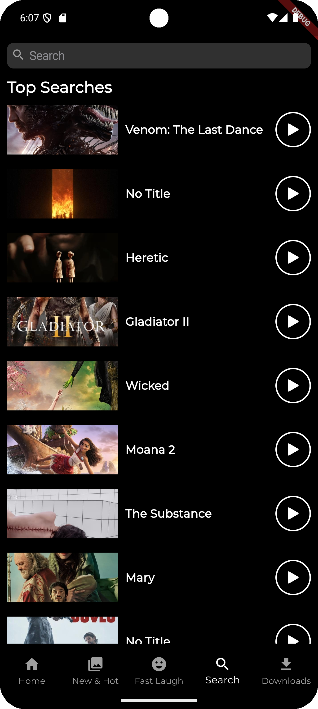
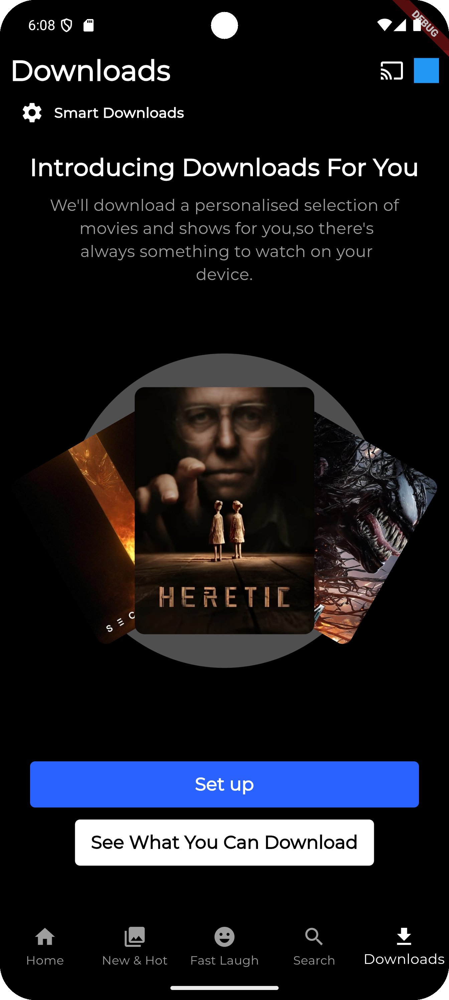

# Netflix Clone App

A feature-rich Netflix UI clone built using Flutter, leveraging the **TMDB API** to fetch real-time movie and TV show data. This project replicates the Netflix interface, showcasing movies, TV shows, trending titles, and genres with a seamless user experience.

## Features
- **TMDB API Integration**: Dynamically fetch and display movie/TV show data.
- **Modern Netflix UI Design**: Responsive layout with smooth scrolling and animations.
- **Bloc Architecture**: Clean separation of UI, business logic, and data using the BLoC (Business Logic Component) pattern for efficient state management.
- **Dynamic Sections**: 
  - Trending Now
  - Popular
  - Top Rated
  - Upcoming
- **Search Functionality**: Search for movies or TV shows using the TMDB API.
- **Movie Details Page**: Displays detailed information about a selected movie or show, including its rating, overview, and genre.
- **Adaptive Design**: Optimized for various screen sizes and platforms.
- **Flutter Theming**: Light and dark theme support to match user preferences.

## Tech Stack
- **Frontend**: Flutter (Dart)
- **Backend API**: TMDB (The Movie Database) API
- **State Management**: Bloc for predictable and maintainable state handling
- **Networking**: `http` package for API integration
- **UI Design**: Custom widgets for clean, reusable components

## Project Structure
The project follows a clean and modular architecture:
```
lib/
├── blocs/                # Contains Bloc files for state management
├── models/               # Data models for TMDB API responses
├── repositories/         # Handles API calls and data manipulation
├── screens/              # All the app's screens
├── widgets/              # Reusable UI components
├── utils/                # Helpers, constants, and utility functions
└── main.dart             # Entry point of the application
```

## Setup Instructions
1. Clone the repository:
   ```bash
   git clone https://github.com/for-trancer/netflix_app.git
   cd netflix_app
   ```

2. Install dependencies:
   ```bash
   flutter pub get
   ```

3. Get a TMDB API Key:
   - Visit [TMDB API](https://www.themoviedb.org/documentation/api) to obtain your API key.

4. Add the API key:
   - Create a file or update the configuration with your TMDB API key:
     ```dart
     const String apiKey = 'your_tmdb_api_key';
     ```

5. Run the application:
   ```bash
   flutter run
   ```

## Screenshots

### Home Screen
{: width="300"}

### New & Hot


### Fast Laugh


### Search


### Downloads


## License
This project is licensed under the MIT License - see the [LICENSE](LICENSE) file for details.
